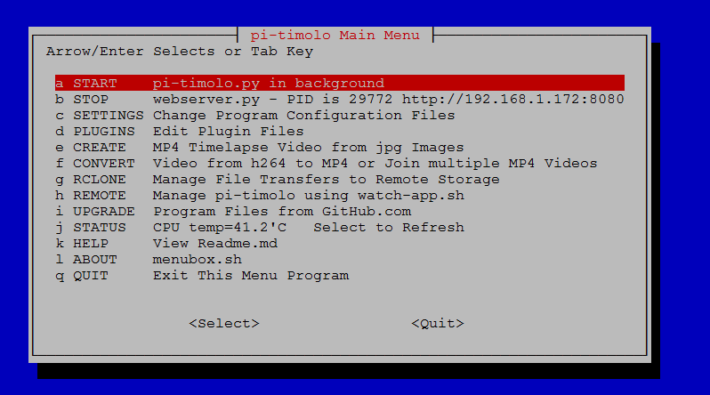

# PI-TIMOLO 
### Raspberry (Pi)camera, (Ti)melapse, (Mo)tion, (Lo)wlight 
## For Details See [Program Features](https://github.com/pageauc/pi-timolo/wiki/Introduction#program-features) and [Wiki Instructions](https://github.com/pageauc/pi-timolo/wiki) and [YouTube Videos](https://www.youtube.com/playlist?list=PLLXJw_uJtQLa11A4qjVpn2D2T0pgfaSG0)

* ***Release 9.x*** New Features have been Added. See Wiki Details below    
 [plugins Setup and Operation](https://github.com/pageauc/pi-timolo/wiki/How-to-Use-Plugins)   
 [Rclone Setup and Media Sync](https://github.com/pageauc/pi-timolo/wiki/How-to-Setup-rclone) (Replaces gdrive)    
 [watch-app.sh Remote Configuration Management](https://github.com/pageauc/pi-timolo/wiki/How-to-Setup-config.py-Remote-Configuration)   
 [python3 Support Details](https://github.com/pageauc/pi-timolo/wiki/Prerequisites#python-3-support)   
* ***Release 10.x*** Added Sched Start to Motion Track, Motion and VideoRepeat. See Wiki Details below    
 [How To Schedule Motion, Timelapse or VideoRepeat](https://github.com/pageauc/pi-timolo/wiki/How-to-Schedule-Motion,-Timelapse-or-VideoRepeat)  
 
## Requirements
Requires a [***Raspberry Pi computer***](https://www.raspberrypi.org/documentation/setup/) and a 
[***RPI camera module installed***](https://www.raspberrypi.org/documentation/usage/camera/).
Make sure hardware is tested and works. Most [RPI models](https://www.raspberrypi.org/products/) will work OK. 
A quad core RPI will greatly improve performance due to threading. A recent version of 
[Raspbian operating system](https://www.raspberrypi.org/downloads/raspbian/) is Recommended.
 
## Quick Install or Upgrade
**IMPORTANT** - It is suggested you do a Raspbian ***sudo apt-get update*** and ***sudo apt-get upgrade***
before curl install, since it is **No longer** performed by the pi-timolo-install.sh script

***Step 1*** With mouse left button highlight curl command in code box below. Right click mouse in **highlighted** area and Copy.     
***Step 2*** On RPI putty SSH or terminal session right click, select paste then Enter to download and run script.     

    curl -L https://raw.github.com/pageauc/pi-timolo/master/source/pi-timolo-install.sh | bash

The command above will download and Run the GitHub ***pi-timolo-install.sh*** script. 
An upgrade will not overwrite configuration files.   

* ***NOTICE*** gdrive is no longer installed with pi-timolo-install.sh, I have been testing
rclone and it is Now the Default. Some ***rclone-*** samples are included. Make a copy of one, rename and edit for
your own needs.  See [Wiki - How to Setup Rclone](https://github.com/pageauc/pi-timolo/wiki/How-to-Setup-rclone).
Note: If a ***/usr/local/bin/gdrive*** File Exists, It Will Remain. Older files are still available on this GitHub Repo.   

## Test Install
To Test Run default config.py - motion track(HD image) plus timelapse(5 min interval). 
 
    cd ~/pi-timolo
    ./pi-timolo.py

### For More Details see [Basic Trouble Shooting](https://github.com/pageauc/pi-timolo/wiki/Basic-Trouble-Shooting) or [pi-timolo Wiki](https://github.com/pageauc/pi-timolo/wiki)

## Description
PI-TIMOLO is primarily designed for ***headless operation*** and includes rclone that
can securely synchronize specified media files with a users remote storage service of choice. This works well for remote security and monitoring
cameras. Camera config.py and conf settings can be easily administered remotely from a designated sync directory using ***watch-app.sh***
script using a crontab entry to periodically check for updates between the pi-timolo camera and a users remote storage rclone service name. 

pi-timolo is a python 2/3 compatible and can take timelapse and motion detection images/videos, separately or together. Will take
long exposure Night (lowlight) images for Time Lapse and/or Motion. Has smooth twilight transitions based on a threshold light
setting, so a real time clock is not required. Customization settings are saved in a ***config.py*** and conf files and optional special
purpose plugin config files. Optional plugin feature allows overlaying config.py settings with custom settings for specific tasks.  

Includes ***makevideo.sh*** to create timelapse or motion lapse videos from images, ***convid.sh*** to convert/combine 
h264 to mp4 format, a simple minumum or no setup web server to view images or videos and ***menubox.sh*** 
to admin settings and stop start pi-timolo and webserver as background tasks. 
       
For more Details see [Github Wiki](https://github.com/pageauc/pi-timolo/wiki)   

## Minimal Upgrade
If you are just interested in a minimal upgrade (must have pi-timolo previously installed)
from a logged in ssh or terminal session execute the following commands.  

    cd ~/pi-timolo
    sudo apt-get install python-opencv
    cp config.py config.py.old
    cp pi-timolo.py pi-timolo.py.old
    wget -O config.py https://raw.github.com/pageauc/pi-timolo/master/source/config.py
    wget -O pi-timolo.py https://raw.github.com/pageauc/pi-timolo/master/source/pi-timolo.py    
    
Edit config.py to transfer any customized settings from config.py.old  
    
## Manual Install or Upgrade  
From logged in RPI SSH session or console terminal perform the following. You can review
the pi-timolo-install.sh script code before executing.

    cd ~
    wget https://raw.github.com/pageauc/pi-timolo/master/source/pi-timolo-install.sh
    more pi-timolo-install.sh    # Review code if required
    chmod +x pi-timolo-install.sh
    ./pi-timolo-install.sh
    
## Menubox
pi-timolo has a whiptail administration menu system. The menu's allow
start/stop of pi-timolo.py and/or webserver.py as background tasks, as well as
editing configuration files, making timelapse videos from jpg images, converting or joining mp4 files Etc.    

To run menubox.sh from ssh console or terminal session execute commands below.

    cd ~/pi-timolo
    ./menubox.sh

 
## Webserver
I have also written a standalone LAN based webserver.py to allow easy access to pi-timolo image and video files
on the Raspberry from another LAN computer web browser.  There is no setup required but the display
settings can be customized via variables in the config.py file or via menubox admin menuing.   
To run from ssh console or terminal session.
    
    cd ~/pi-timolo
    ./webserver.py

 
## Reference Links  
Detailed pi-timolo Wiki https://github.com/pageauc/pi-timolo/wiki  
YouTube Videos https://www.youtube.com/playlist?list=PLLXJw_uJtQLa11A4qjVpn2D2T0pgfaSG0
 
Good Luck
Claude Pageau 
